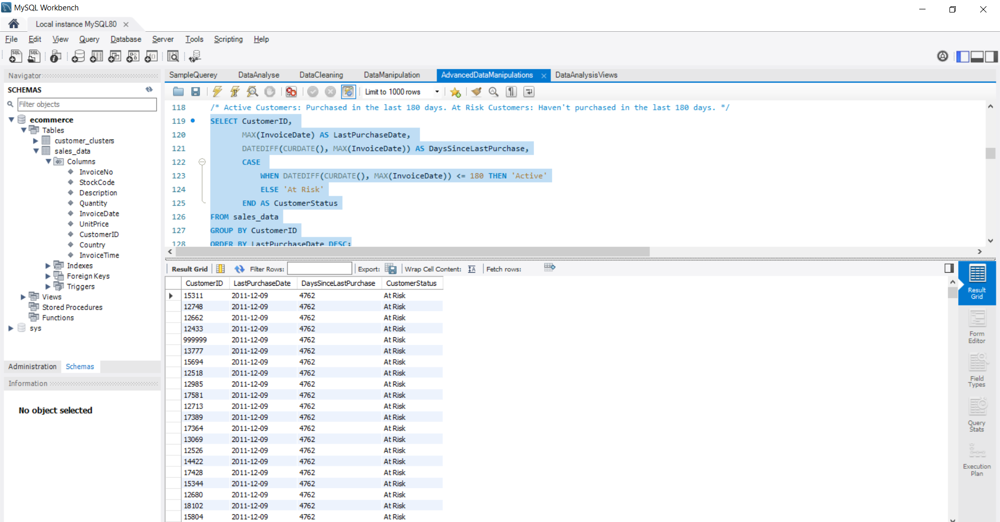
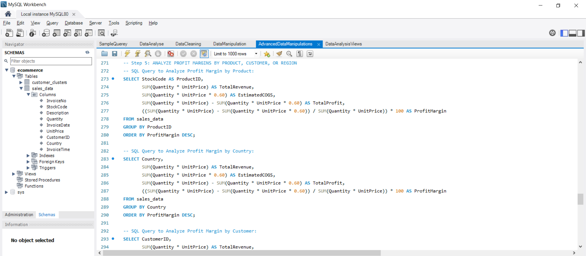
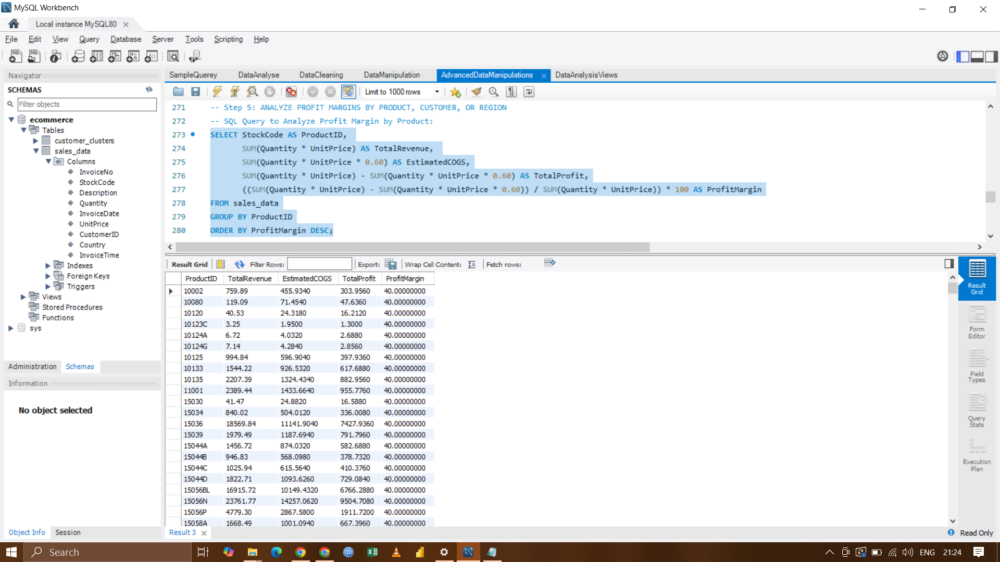
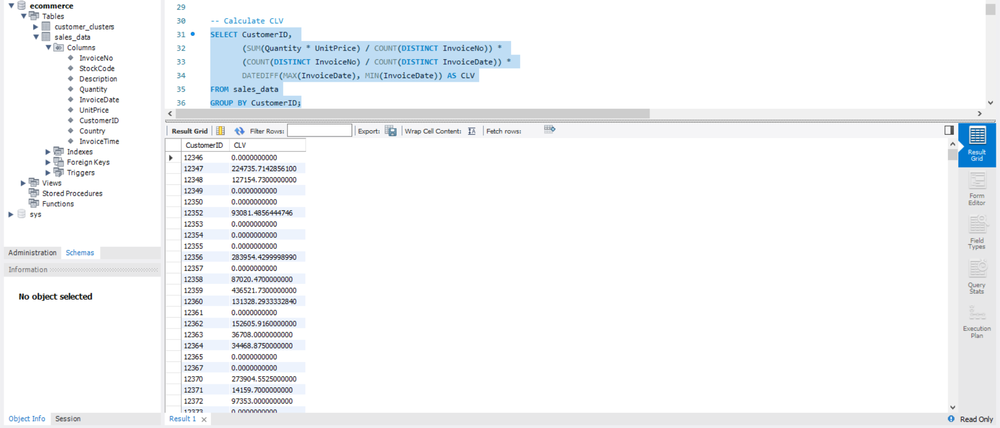

# SQL E-Commerce Data Analysis Project 📊

This project analyzes real-world transactional data for a UK-based online retail company selling unique all-occasion gifts. The dataset, sourced from the UCI Machine Learning Repository, includes transactions between **01/12/2010** and **09/12/2011**. The analysis focuses on uncovering trends, customer behavior, and product insights through structured queries.

## Dataset Overview
- **Source**: UCI Machine Learning Repository
- **Content**: Transactions from a UK-based online retailer
- **Period**: 01/12/2010 to 09/12/2011
- **Features**:
  - `InvoiceNo`: Unique identifier for each invoice
  - `StockCode`: Unique product code
  - `Description`: Product description
  - `Quantity`: Number of items per transaction
  - `InvoiceDate`: Date and time of the transaction
  - `UnitPrice`: Price per item
  - `CustomerID`: Unique customer identifier
  - `Country`: Country of the customer

## Project Highlights
1. **Data Cleaning**:
   - Handling missing values
   - Removing duplicate transactions
   - Correcting invalid entries
2. **Basic Analysis**:
   - Total sales
   - Top-selling products
   - Sales trends by month and day
3. **Advanced Insights**:
   - Customer segmentation using RFM (Recency, Frequency, Monetary) analysis
   - Sales by country
   - Product return analysis
4. **Visualization**:
   - Prepared for Power BI dashboards (future integration).

## Files in the Repository
- `basic_queries.sql`: Simple queries for basic analysis.
- `advanced_queries.sql`: Complex queries for in-depth insights.
- `data_cleaning.sql`: Scripts for cleaning and preparing the dataset.
- `screenshots/`: Screenshots of query results and outputs.

## How to Run
1. Import the dataset into an SQL database (MySQL was used for this project).
2. Use the SQL files provided to run the queries in the appropriate order:
   - Start with `data_cleaning.sql`.
   - Run `basic_queries.sql` for foundational analysis.
   - Explore `advanced_queries.sql` for deeper insights.
3. Tools: MySQL Workbench, SQL Server Management Studio, or any SQL IDE.

## Dataset Source
[Dataset](https://drive.google.com/file/d/1nSK-pl44AnNEVDnYeL6w63UcxdoxSTvT/view?usp=drive_link)

## Screenshots
- **CHURN ANALYSIS (Customer Attrition)**  
  .png)
  
- **CHURN ANALYSIS OUTPUT**  
  

- **Profit Margin By Product**  
  
  
- **Profit Margin Output**  
  
  
- **CUSTOMER LIFETIME VALUE (CLV) Analysis**  
   Analysis.png)

- **Profit Margin**  
  

## License
This project is licensed under the MIT License. Please look at the [LICENSE](./LICENSE) file for details.

## Contact
Feel free to reach out for questions or feedback:
- **Email**: ajeetsingh7632@gmail.com.com
- **LinkedIn**: [Ajeet Singh](https://www.linkedin.com/in/ajeet-singh-66810616a/)
